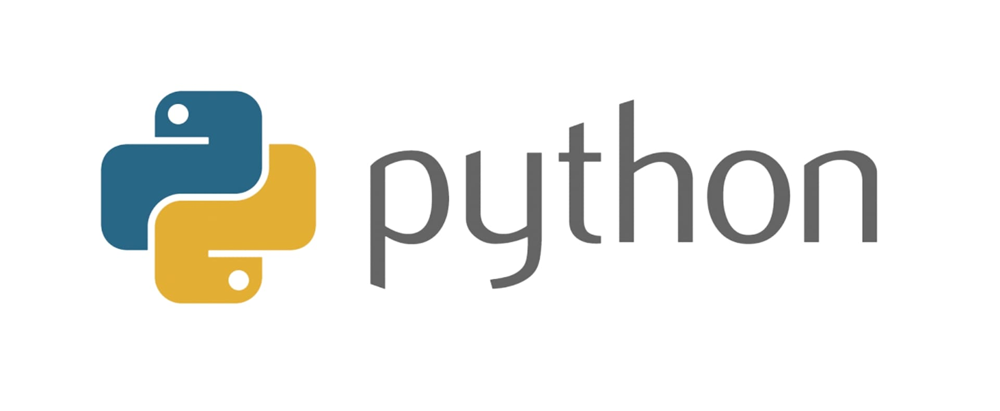

# PYTHON 

> One paragraph statement about the project.



Additional description about the project and its features.

## FEATURES

- High-level language. Simple and clear grammar. 
- Strong and dynamic typing. 
- Object oriented
- Open Source

## INSTALLATION

### Windows

`https://www.python.org/downloads/`

### Linux

`https://docs.python-guide.org/starting/install3/linux/`

## GETTING STARTED

### Functions

    A function is a block of code that works as a unit to do a specific task. Python functions can return values and can have parameters or arguments. Functions are also called 'methods' when it is defined inside a class.

Syntax:

```
def function_name():
    function instrunction1
    function instrunction2
    function instrunction3
    return (optional)
```

### Lists

    Lists are data structures that can store multiple items in a single variable. In Python, lists can store different types of values, and they can be dinamically expanded adding new elements. 

Syntax:

```
listName = [element1, element2, element3]
```

### Tuples

    Tuples are immutable lists, they cannot be modified. They are faster and lighter than lists, and can be used as keys in a dictionary.

Syntax:

```
tupleName = (element1, element2, element3)
```

### Dictionaries

    Dictionaries or associative arrays are data structures consisting of a collection of key-value pairs.

Syntax:

```
dictionaryName = {
    'name': 'myname'
    'age': 'myage'
    'id': 'myid'
}
```

### Conditionals: if

Syntax:

```
if condition:
    expression
elif condition:
    expression
else:
    expression
```

### Generators

    Generators are structures that allow you to declare a function that behaves like an iterator. They are more efficient than normal functions, useful with lists with infinite values.

[Check this](/demos/basics/generators.py) 

### Exceptions

    Exceptions are errors ocurring during programm execution. Code syntax is correct but the programm does not work as expected.

[Exceptions basics](/demos/basics/exceptions.py)

[Exceptions by blocks](/demos/basics/exceptions_II.py)

[Raise exceptions](/demos/basics/exceptions_III.py)

### Object oriented programming

    OOP: programming paradigm based on the concept of "objects", which can contain data and code: data in the form of fields (attributes or properties), and code in the form of procedures (methods). The most popular OOP languages are class-based, meaning that objects are instances of classes, which also determine their types.

Advantages:

* Modularization: programms divided in parts or modules. 
* Reusable: inheritance.
* Exception treatment
* Encapsulation

Definitions: 

- `Class: Classes provide a means of bundling data and functionality together. Creating a new class creates a new type of object, allowing new instances of that type to be made. Each class instance can have attributes attached to it for maintaining its state. Class instances can also have methods (defined by its class) for modifying its state.`
- `Object: An object is simply a collection of data (variables) and methods (functions) that act on those data.`
- `Class instance: An individual object of a certain class. An object obj that belongs to a class.`
- `Modularization: Modular programming is a software design technique to split your code into separate parts. These parts are called modules. The focus for this separation should be to have modules with no or just few dependencies upon other modules.`
- `Encapsulation: Encapsulation is the packing of data and functions operating on that data into a single component and restricting the access to some of the object's components. Encapsulation means that the internal representation of an object is generally hidden from view outside of the object's definition.`
- `Inheritance: Inheritance allows us to define a class that inherits all the methods and properties from another class. Parent class is the class being inherited from, also called base class. Child class is the class that inherits from another class, also called derived class.`
- `Polymorphism: Polymorphism is the ability to leverage the same interface for different underlying forms such as data types or classes. This permits functions to use entities of different types at different times.`


### Prerequisites

### Setup

### Install

### Usage

### Run tests

### Deployment


## Authors

👤 **Author1**

- GitHub: [@githubhandle](https://github.com/githubhandle)
- Twitter: [@twitterhandle](https://twitter.com/twitterhandle)
- LinkedIn: [LinkedIn](https://linkedin.com/linkedinhandle)

👤 **Author2**

- GitHub: [@githubhandle](https://github.com/githubhandle)
- Twitter: [@twitterhandle](https://twitter.com/twitterhandle)
- LinkedIn: [LinkedIn](https://linkedin.com/linkedinhandle)

## 🤝 Contributing

Contributions, issues, and feature requests are welcome!

Feel free to check the [issues page](issues/).

## Show your support

Give a ⭐️ if you like this project!

## Acknowledgments

- Hat tip to anyone whose code was used
- Inspiration
- etc

## 📝 License

This project is [MIT](lic.url) licensed.
